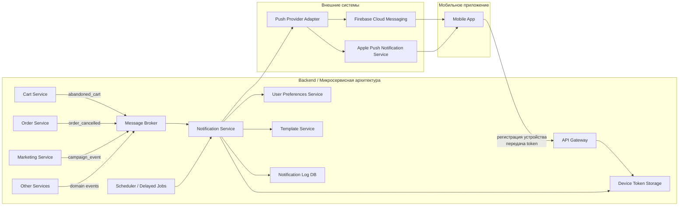
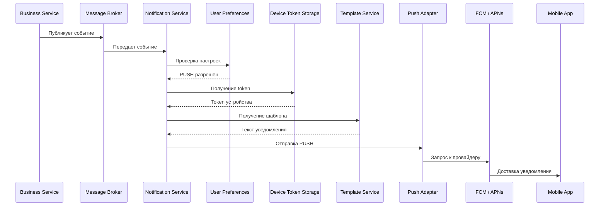

# Задание 1: Анализ требований  
## Функционал «Корзина» интернет-магазина «Петрушка Зеленая»

## 1. Противоречия и недочёты

### 1.1 Противоречие по цене товара (п.7 и п.13)

- **П.7:** Цена фиксируется на момент добавления в корзину и не меняется  
- **П.13:** Цена должна автоматически обновляться при изменении в каталоге  

Противоречие: цена не может одновременно фиксироваться и обновляться.

**Проблема:** невозможно определить, по какой цене пользователь будет оплачивать заказ.

---

### 1.2 Противоречие при изменении количества (п.2 и п.9)

- **П.2:** Количество можно уменьшить не менее чем до 1, удаление — отдельной кнопкой  
- **П.9:** Если количество уменьшено до 0, товар удаляется  

Противоречие: в одном пункте значение 0 запрещено, в другом — допускается.

**Проблема:** непонятно, можно ли вводить 0 в поле количества.

---

### 1.3 Неясность лимита на один товар (п.1)

Указано: от 1 до 10 единиц одного товара.

Не уточнено:

- лимит действует за одно добавление или суммарно в корзине  
- можно ли добавить товар повторно  
- учитывается ли уже добавленное количество  

---

### 1.4 Ограничение на количество товаров (п.3)

В корзине не более 5 различных товаров.

Не определено, что считается «различным товаром»:
- разные SKU?
- разные позиции каталога?
- один товар с разными характеристиками?

---

### 1.5 Общий лимит количества (п.4)

Общее количество товаров ≤ 20.

Не описано:

- что происходит при изменении количества  
- какой лимит приоритетнее при конфликте  
- учитываются ли уже добавленные товары  

---

### 1.6 Сообщение об ошибке (п.6)

Для всех нарушений используется одно сообщение:  
> «Лимит корзины превышен»

Недостаточно информативно, так как лимитов несколько.

---

### 1.7 Избыточный пункт (п.5)

«Товары в корзине могут быть разные»

Не содержит требований, не влияет на функциональность.

---

### 1.8 Отображение корзины (п.8)

Указаны:

- список товаров  
- количество  
- цена  
- стоимость позиции  

Не указана итоговая стоимость всей корзины.

---

### 1.9 Реклама (п.10–11)

- В корзине может быть реклама  
- Реклама должна быть каждый будний день утром и вечером  

Не определено:

- точное время показа  
- часовой пояс  
- обязательность показа  
- поведение в выходные  

---

### 1.10 Ошибка нумерации

Отсутствует пункт 12.

Может указывать на неполноту документа.

---

## 2. Исправленная версия требований

### Функционал корзины

1. Пользователь может добавить в корзину от 1 до 10 единиц одного товара.  
   Максимальное количество данного товара в корзине — 10 единиц.

2. Пользователь может изменить количество товара в корзине в диапазоне от 1 до 10.  
   Для удаления товара используется кнопка «Удалить».

3. В корзине может находиться не более 5 различных товаров (позиций).

4. Суммарное количество всех товаров в корзине не может превышать 20 единиц.

5. При попытке добавить товар или изменить количество с превышением ограничений система выводит соответствующее сообщение об ошибке.

6. Цена товара фиксируется на момент добавления в корзину и используется при оформлении заказа.

7. На странице корзины отображаются:
   - список товаров  
   - количество каждого товара  
   - цена за единицу  
   - стоимость позиции  
   - итоговая стоимость корзины  

8. Пользователь может удалить товар из корзины с помощью кнопки «Удалить».

9. На странице корзины может отображаться рекламный блок с рекомендациями товаров.

10. Рекламный блок отображается в будние дни с 08:00 до 11:00 и с 18:00 до 21:00 по местному времени пользователя.

---

## 3. Уточняющие вопросы заказчику

### По логике корзины

1. Сохраняется ли корзина между сессиями пользователя?
2. Одинакова ли логика для авторизованных и неавторизованных пользователей?
3. Есть ли срок хранения корзины?

---

### По товарам и ограничениям

4. Что считается «различным товаром» (SKU, позиция каталога, вариант)?
5. Можно ли добавлять товар повторно, если он уже есть в корзине?
6. Какой лимит приоритетнее при конфликте ограничений?

---

### По цене

7. Должна ли цена в корзине совпадать с ценой при оформлении заказа?
8. Что делать, если товар подорожал или подешевел после добавления?

---

### По рекламе

9. Обязателен ли показ рекламы или опционален?
10. Нужно ли учитывать часовой пояс пользователя?
11. Может ли пользователь отключить рекламу?

---

# Задание 2: Проектирование API  
## Экран выбора магазина-партнера

### Описание

При переходе пользователя на экран «Выберите магазин» приложение получает список партнёрских магазинов с информацией о доставке и ссылкой для перехода на внешний сайт.

---

## Пример REST API запроса

`GET /api/v1/partners/stores`

---

## Пример ответа API (JSON)

```json
{
  "stores": [
    {
      "id": "metro",
      "name": "METRO",
      "logoUrl": "https://cdn.petrushka.ru/logos/metro.png",
      "delivery": {
        "type": "scheduled",
        "nearestSlot": {
          "date": "2026-03-18",
          "from": "21:00",
          "to": "23:00",
          "text": "Ближайшая доставка сегодня 21:00–23:00"
        }
      },
      "redirectUrl": "https://metro.ru"
    },
    {
      "id": "auchan",
      "name": "Ашан",
      "logoUrl": "https://cdn.petrushka.ru/logos/auchan.png",
      "delivery": {
        "type": "scheduled",
        "nearestSlot": {
          "date": "2026-03-18",
          "from": "18:00",
          "to": "20:00",
          "text": "Ближайшая доставка сегодня 18:00–20:00"
        }
      },
      "redirectUrl": "https://auchan.ru"
    },
    {
      "id": "vkusvill",
      "name": "ВкусВилл",
      "logoUrl": "https://cdn.petrushka.ru/logos/vkusvill.png",
      "delivery": {
        "type": "express",
        "timeMinMinutes": 20,
        "timeMaxMinutes": 60,
        "text": "Быстрая доставка от 20 до 60 минут"
      },
      "redirectUrl": "https://vkusvill.ru"
    },
    {
      "id": "victoria",
      "name": "Виктория",
      "logoUrl": "https://cdn.petrushka.ru/logos/victoria.png",
      "delivery": {
        "type": "scheduled",
        "nearestSlot": {
          "date": "2026-03-18",
          "from": "17:00",
          "to": "19:00",
          "text": "Ближайшая доставка сегодня 17:00–19:00"
        }
      },
      "redirectUrl": "https://victoria-group.ru"
    }
  ]
}

```

# Задание 3: Архитектура 
## Основная идея архитектуры

Отправка PUSH строится по **событийной модели**:

1. В одном из микросервисов происходит бизнес-событие  
   (например, заказ отменён или корзина заброшена)
2. Событие публикуется в брокер сообщений
3. Сервис уведомлений получает событие
4. Определяется, нужно ли отправлять PUSH
5. Формируется текст уведомления
6. PUSH отправляется через внешний push-провайдер  
   (Firebase Cloud Messaging / Apple Push Notification Service)
7. Результат отправки логируется и сохраняется

## Верхнеуровневая архитектура PUSH-уведомлений



**Ключевые компоненты:**
* Business Services — источники событий
* Message Broker — асинхронная передача
* Notification Service — логика уведомлений
* User Preferences — настройки пользователя
* Device Token Storage — токены устройств
* Template Service — шаблоны сообщений
* Push Adapter — интеграция с FCM и APNs
* Notification Log DB — журнал отправки
* Scheduler — отложенные уведомления

## Сценарий отправки PUSH


